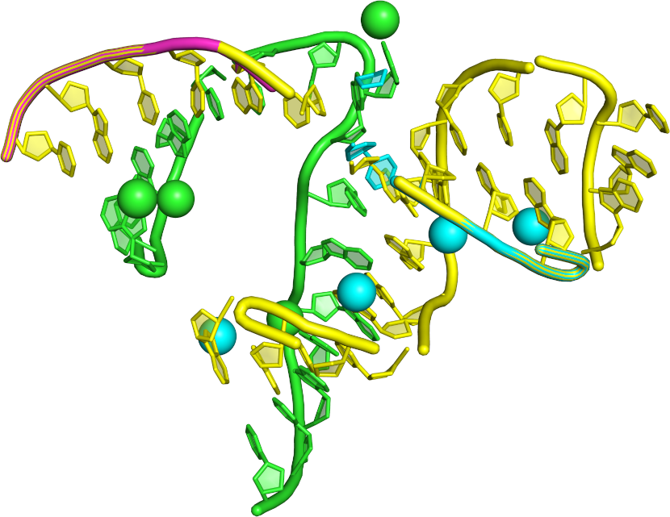
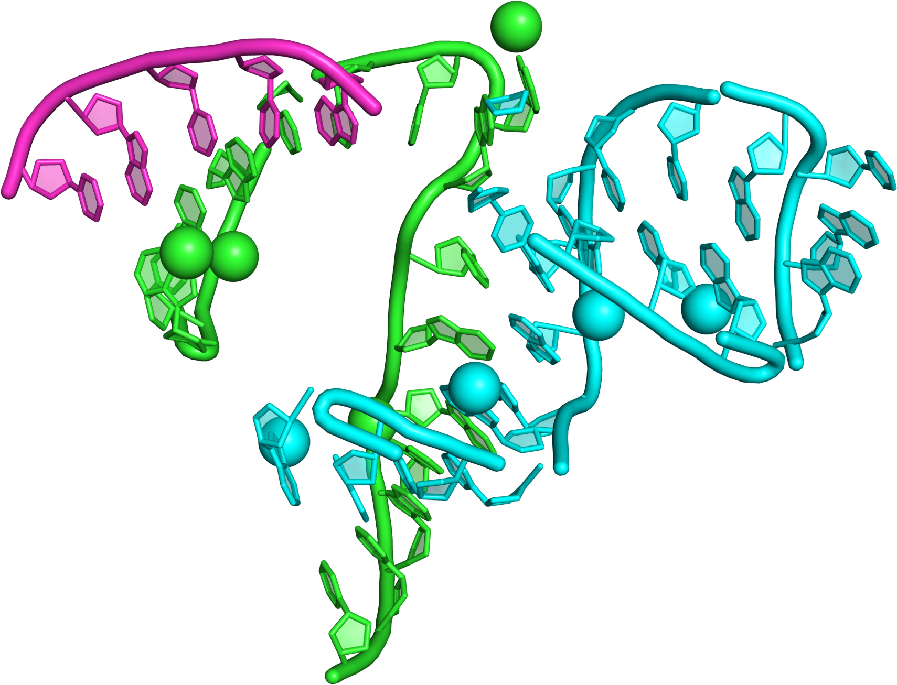
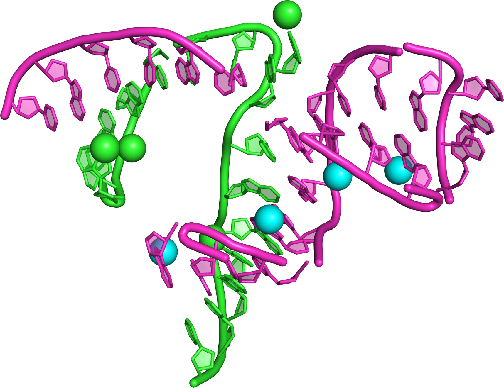

# occupancy-splitter

## Description

`occupancy-splitter` is an application which reads PDBx/mmCIF files which contain overlapping chains due to experimental conditions (i.e. the occupancy factor is less than 1.0). The program will find the largest subsets of chains, which are clash-free and write them in separate output files. This works well with, i.a., X-Ray structures containing mobile RNA fragments or ones undergoing big structural rearrangements (e.g., during ribozyme cleaving).

## Requirements

- Java 11
- Maven

## Building

```sh
mvn package
```

## Usage

```sh
./occupancy-splitter -i <PATH-TO-MMCIF-FILE>
```

## Example

The example is based on structure with PDB id 488D described in:

> Capture and Visualization of a Catalytic RNA Enzyme-Product Complex Using Crystal Lattice Trapping and X-Ray Holographic Reconstruction. J.B. Murray et al. _Molecular Cell_. 2000. 5(2):279–287. doi:[10.1016/S1097-2765(00)80423-2](https://doi.org/10.1016/S1097-2765(00)80423-2)

: Input with overlaps (chains with mixed colors)

```sh
$ ./occupancy-splitter -i 488D.cif
Output file: 488D-B-C.cif
Output file: 488D-D.cif
```

: 488D-B-C, ribozyme with two cleaved strands

: 488D-D, ribozyme with one uncleaved substrate
